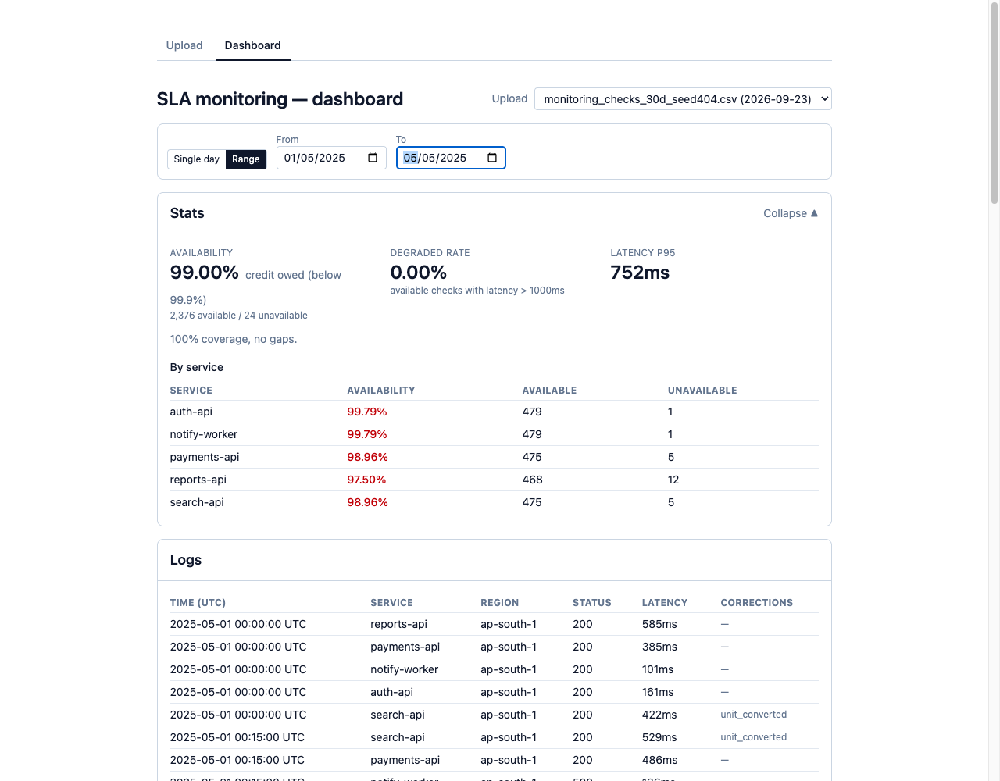

# SLA Monitoring Dashboard

Upload a CSV of health-check logs, have it parsed and cleaned by a serverless function
running in the cloud, persist the result to a database, and look at what happened on a
dashboard. The point of the exercise is the pipeline, so most of my effort went into two
places: working out what is actually wrong with the data before touching any of it, and
deciding what "available" means precisely enough to defend a billing credit.

## Live

- Dashboard and upload UI: https://sla-frontend.blusinghaditya.workers.dev
- API (the stateless function): https://sla-worker.blusinghaditya.workers.dev
- Last verified live: **2026-09-23, ~10:40 UTC** — after redeploying the fixed Worker, the
  full 15,578-line CSV uploaded again through the deployed UI in a real browser, then
  queried back from a fresh browser context with no client state.



Everything is on Cloudflare's free tier with no card on file, so nothing can roll off a
paid tier and take the link down. If it is ever down, the redeploy instructions are at the
bottom and take about two minutes.

## Architecture

| Piece | What it is | Where it runs |
|---|---|---|
| Upload UI + dashboard | React 19 + Vite + Tailwind v4, static build | Cloudflare Workers static assets, `sla-frontend` |
| Stateless processing | Cloudflare Worker, TypeScript | `sla-worker.blusinghaditya.workers.dev` |
| Database | Cloudflare D1 (SQLite) | `sla-monitoring` |

I picked Cloudflare for three reasons. The assignment requires the function to genuinely
run in the cloud rather than in a container standing in for one, and `wrangler deploy`
puts a real Worker at a real public URL in one command. The free tier needs no credit
card, so there is no way for this to quietly stop being live before someone reviews it.
And Workers, D1, and the static hosting are one provider behind one CLI, which keeps the
deploy story short enough that I can explain all of it.

The frontend was originally meant to be classic Cloudflare Pages. Partway through
deployment I found that `wrangler pages project create` no longer creates a classic Pages
project on a new account — it delegates to Cloudflare's unified Workers-plus-assets
platform, so the site lands on `*.workers.dev` rather than `*.pages.dev`, and the command
rewrites your Vite config and npm scripts on the way through. I accepted that rather than
fighting the deprecation: it is the same provider, the same free tier, the same CLI, and
the same one-deploy-story reasoning that made me choose Pages in the first place.
Cloudflare merged the two mechanisms and renamed the result.

### How the data moves

The browser reads the CSV, splits it on line boundaries into chunks of 1,000 data rows,
and POSTs each chunk to the Worker in order. It does no parsing, validation, or cleaning —
it splits bytes at newlines and prepends the header to each chunk so every chunk is
self-describing. All of the cleaning runs in the deployed Worker, which is what the
assignment asks for.

Chunking is not decoration. The Workers free tier allows 10 ms of CPU per invocation and
D1 allows 50 queries per invocation, and parsing 15,577 rows does not fit in 10 ms. Each
chunk is a separate invocation with a fresh budget, so the largest file becomes 16
requests against a 100,000-request daily allowance. It also means the progress bar reports
real progress instead of animating.

Ingest is three endpoints — open an upload, post chunk *n*, finalize — and each is
stateless, with all state in D1:

```
POST /uploads                        open an upload
POST /uploads/:id/chunks/:index      ingest one chunk (idempotent)
POST /uploads/:id/finalize           close it out
GET  /uploads                        list uploads, newest first
GET  /uploads/:id/stats?from=&to=    stats for a date or range
GET  /uploads/:id/logs?from=&to=     paginated check records
```

Inserts go through `json_each`. D1 caps bound parameters at 100 per statement, so an
11-column multi-row `VALUES` insert fits 9 rows — about 1,730 statements for the largest
file, far past the 50-query ceiling. Instead each insert is one statement with the rows
carried as a single JSON string parameter, whose ceiling is the 2 MB maximum bound string
rather than 100 parameter slots. I settled on 500 rows per statement: a row serialises to
roughly 120 bytes, so that payload is about 60 KB, three percent of the limit. A 1,000-row
chunk is therefore two insert statements plus a counter insert — three queries against a
budget of fifty, with room to raise the chunk size later without redesigning anything.

D1's `batch()` commits statements sequentially rather than giving all-or-nothing rollback,
so I did not pretend otherwise. Every insert is `INSERT OR IGNORE` against a unique index
that defines what an exact duplicate is, per-chunk counters are keyed by
`(upload_id, chunk_index)`, and an upload that never reaches finalize stays `open`. A
retried chunk cannot double-count, and a partially ingested file is visibly partial rather
than silently short.

## Data findings

The data is five independent simulations of the same five services at one check every 15
minutes, spanning 9 to 30 days. I never opened a CSV whole — every figure below comes from
aggregation scripts that read row by row and print only counts, committed in
`docs/profiling/` so each number can be re-derived. The full write-up, with examples and
row counts per file, is in `docs/data-findings.md`; the handling rules are in
`docs/decisions.md`.

| # | Issue | Scale | How I handled it |
|---|---|---|---|
| F1 | `latency` is in two different units, labelled by a `latency_unit` column | ~20% of rows are seconds | Multiply seconds by 1000 on ingest and store `latency_ms` as milliseconds always. The unit column is not stored. |
| F2 | Timestamps arrive in three formats: `...Z`, 10-digit epoch seconds, and `+05:30` offsets | all five files | Parse all three to one UTC instant, stored as epoch seconds. Unparseable rows are rejected. |
| F3 | 73 rows carry a calendar date that is not their UTC date | 3–26 rows per file | No separate rule. The `day` column is derived from the UTC instant, never from the source string, so an IST date cannot leak into the wrong bucket. |
| F4 | The same check-point is reported more than once, by two different agents | 352–1,169 points per file | Keep every row. Availability is computed per check-point, not per row, and multiple reports are resolved at query time. |
| F5 | Exact duplicate rows | 6–24 groups per file, all status 200 | Discarded on insert, counted separately from rejections. The unique index enforces this, so duplicates that straddle a chunk boundary are still caught. |
| F6 | The same agent reports the same check-point twice, agreeing on status, with latency in one copy and blank in the other | 2 cases | Falls out of resolution for free: latency is the mean of the non-null reports, so the blank contributes nothing rather than winning a coin toss. |
| F7 | The two agents disagree about a status code | 1 case in 3,300 co-observed points | Worst status wins. |
| F8 | Status code `999`, exactly once per file | 5 rows | Classified `invalid`, not repaired. It stays in the logs view but is excluded from both sides of the availability ratio. |
| F9 | Negative latency, exactly once per file | 5 rows | `latency_ms` set to null, status untouched, flag recorded. |
| F10 | Empty `latency` on otherwise valid rows | ~1.2% of rows | Accepted with a null latency. The row still counts toward availability and not toward latency. |
| F11 | Incidents include latency brownouts that return `200` | 6–20 rows per file, clustered on one service-day | Availability stays status-only; each available check-point also carries a `degraded` flag at latency > 1000 ms, reported as its own statistic. |
| F12 | The five files collide with each other on `(service_id, timestamp)` and disagree | 132–216 disagreements per overlapping pair | Rows are scoped to an `upload_id` and the dashboard filters by upload, so two files can never merge into one availability figure. |
| F13 | `region` is a single value everywhere; `service_name` is functionally dependent on `service_id` | all rows | Cosmetic. Both stored as-is — denormalising five low-cardinality values across 15k rows is cheaper than a join on every query. |

Three of these deserve more than a table row.

**Units (F1)** matter more than they look. Treating the latency column as one unit
understates mean latency by about 30% — 254–257 ms naive against 363–367 ms converted,
consistent across all five files — and it understates it, which is the direction that makes the
service look better than it is. Every latency figure on the dashboard would have been
quietly wrong.

**The `+05:30` timestamps (F2)** could have been read two ways: as genuine IST instants, or
as local wall-clock that was mislabelled and should have its offset dropped. I did not have
to guess. After converting all three formats to UTC, every timestamp in all five files lands
exactly on a 15-minute boundary with no gaps anywhere. Under the other reading, converting
opens 25 to 99 holes in the grid per file and creates a matching number of collisions.
Zero holes one way and 250 across the corpus the other way is not a coincidence, so the
offsets are real and the rows get converted.

**Brownouts (F11)** are the finding with the largest consequence. Latency outliers are not
scattered; they cluster on exactly the service-day that `dataset_incident_log.json`
declares as the seeded incident, and within that window 5xx responses interleave with
`200`s at 2,193 ms and 2,983 ms. An availability number computed purely from status codes
reports that service at 8.33% down on the day while it was in fact serving three-second
responses through the middle of the incident. That is why the dashboard reports degraded
rate as its own number.

### Things I checked that turned out to be fine

Worth recording, because these are the first questions a reviewer asks. There are **no**
missing check-points — every service has all 96 daily points for every day in every file,
so this dataset has no gap-versus-downtime problem (though cleaning can create one, which
is why coverage is on the dashboard). There are no malformed or ragged rows, no naming
drift, no empty fields outside `latency`, no off-grid timestamps, no 4xx codes anywhere,
no sentinel values like `-1` or `9999`, no millisecond-versus-second ambiguity in the
epoch timestamps, and a byte-identical header across all five files.

## Assumptions

The spec is ambiguous in exactly the places that decide the number, so these are the
choices I made and why. All of them are argued at more length in `docs/decisions.md`.

**A check-point is the unit, not a row.** A check-point is one `(service, instant)` pair on
the 15-minute grid — the thing that was supposed to be measured. Availability is computed
over check-points, so the denominator depends on elapsed time rather than on how many
agents happened to be watching. Counting rows instead would make the SLA figure a function
of observer coverage, and the bias does not even have a predictable sign: in one file
row-wise availability is *lower* than per-check-point, in the other four it is higher.

**"Available" is an allowlist.** 2xx and 3xx are available, 5xx is unavailable, anything
else is `invalid`. I deliberately did not write this as "not 5xx", which gives the right
answer for `999` and the wrong answer for a `404` — this column should be correct for
status codes the dataset does not happen to contain.

**`999` is unknown, not repaired.** All five occurrences carry healthy latency, and in one
case the other agent reported `200` at 638 ms at the very same instant the first reported
`999` at 632 ms. The check almost certainly succeeded. I still did not rewrite it to `200`,
because that invents a value nobody recorded. It is marked invalid and excluded from both
the numerator and the denominator of availability, and it stays visible in the logs.

**Worst status wins when reports disagree.** This number decides a billing credit, and
ambiguity should not favour the party computing the bill. In practice it is nearly free:
the agents agree at 3,299 of 3,300 co-observed check-points.

**Three denominators, not one.** Availability excludes unclassifiable points. Latency is
computed only over reports that have a latency, because 1.2% of rows do not and a row
without a latency is still evidence the check ran. Coverage is observed points over
expected points. Presenting all of these from one `COUNT(*)` would misstate at least one.

**Coverage is an alarm, not a KPI.** Since the data has zero missing check-points, coverage
must read exactly 100%, and anything less is a bug in my cleaning rather than a fact about
the services. It renders as a status line, not as a headline tile.

**Slow is not down.** A latency threshold does not turn a successful check into downtime,
because that conflates two SLOs and changes the credit owed on grounds the contract never
mentions. Degradation is tracked separately at **latency > 1000 ms**, chosen as the
smallest round number above the observed p95 of 754–766 ms. It catches every brownout row
without flagging ordinary traffic, and it correctly yields zero for the one file whose
incidents are pure 5xx with no latency excursion.

**Everything is UTC, and the dashboard says so.** UTC matches the majority timestamp
format and the incident log's own description of its windows, and it has no DST edge
cases. IST was tempting — the offsets and the `ap-south-1` tag both suggest an operator in
India — but it shifts every day boundary by 5h30m and re-buckets exactly the 73 rows from
F3. The label is not decoration; those rows are precisely where a reader assuming local
time reads the wrong day.

**Cleaning is not destructive.** Accepted rows are stored with corrections applied plus a
list naming what changed on that row; every correction is a deterministic transform of a
value that can be reconstructed, except the two that set null, where the flag itself
records what was there. Rows that fail structural validation go to a separate
`rejected_rows` table with the raw line and a reason. Per-chunk counts are stored rather
than computed and thrown away, so the upload summary is a query rather than a number that
existed only in one HTTP response.

**Uploads do not merge.** Because the five files disagree with each other at up to 216
shared check-points per pair, merging them would make availability a function of upload
order. Scoping rows to an upload makes that collision impossible rather than resolving it
arbitrarily. The cost is a dataset selector on the dashboard, which I took knowingly.

**One correction I made by extension rather than by instruction.** Negative latency (F9)
becomes null rather than `abs()`. The magnitudes are plausible, which makes `abs()`
tempting, but it repairs a corrupt field by guessing at intent — the same thing I declined
to do for `999`. It affects one row per file, so it cannot move any published figure.

### Which stats to show

The endpoint computes ten numbers. The dashboard shows four, because showing everything
computable is the absence of a decision. I wrote the list against two readers: an on-call
engineer asking "is something broken, which thing, how bad", and a billing analyst asking
"is a credit owed, and can I defend it in a dispute".

- **Availability, with the credit verdict attached** — rendered as `98.74% — credit owed
  (below 99.9%)`, not as a bare percentage, because making that comparison is the reason
  the dashboard exists. The supporting `N available / M unavailable` counts sit underneath
  it, since a credit dispute is exactly where an unchecked percentage is worth least.
- **Degraded rate** — having argued that a brownout must never fold into uptime, I have to
  show both numbers, or the separation becomes a way of hiding the brownout rather than of
  measuring it.
- **Latency p95** — the on-call number. Nearest-rank, computed in the Worker after one
  read, since SQLite has no percentile function.
- **Coverage**, as a one-line data-integrity check rather than a fourth tile.

Mean latency is deliberately absent: p95 is the SLO-relevant figure, and a mean beside it
invites averaging away the tail that the degraded flag exists to surface. The count of
excluded points appears only when it is non-zero, as a footnote explaining why
availability's denominator is smaller than the total.

The one addition I made after building it: the blended figure is **wrong** for a credit
decision on its own, because credits are owed per service. A blended number hides one
service's breach behind four healthy ones and implies a credit for the four that met their
SLO. So the stats section also breaks availability down per service, with any service
below 99.9% flagged. On the live dataset the blend reads 98.74% and the per-service spread
runs from 97.15% for `reports-api` to 99.72% for `notify-worker` — every service is owed a
credit here, but the blended figure alone would not tell you that `reports-api` is three
times worse than the number suggests, or which service to look at first.

Availability, coverage, and degraded rate can each be `null` — meaning "no resolvable
check-points in this range" — and that is rendered as a no-data state rather than as `0%`.
A zero would read as a confirmed total outage, which is a different fact.

## Running it locally

Prerequisites: Node 20+ and a Cloudflare account (free) if you want to deploy.

```bash
# Worker: apply migrations to the local D1, then serve on :8787
cd worker
npm install
npx wrangler d1 migrations apply sla-monitoring --local
npm run dev

# Frontend, in a second terminal
cd frontend
npm install
cp .env.example .env        # VITE_WORKER_URL=http://localhost:8787
npm run dev
```

Open the Vite URL, upload `fixtures/dev_checks.csv` (a 200-row fixture hand-built to
contain every issue class above — `fixtures/dev_checks.md` says which row is which), and
the dashboard tab will preselect it.

Tests are in the Worker and cover the cleaning rules, check-point resolution, query
parameter validation, and the ingest and query endpoints against a real local D1:

```bash
cd worker && npm test     # 93 tests, 6 files
```

## Redeploying

```bash
# Database, first time only
cd worker
npx wrangler d1 create sla-monitoring          # put the id in wrangler.jsonc
npx wrangler d1 migrations apply sla-monitoring --remote

# Worker
cd worker && npm run deploy

# Frontend — the Worker URL is baked in at build time, so it must be set
cd frontend
VITE_WORKER_URL=https://sla-worker.blusinghaditya.workers.dev npm run deploy
```

That environment variable is the one real trap. Vite inlines it at build time, so a build
without it ships a bundle pointing at `localhost:8787` and the deployed site fails with no
obvious cause. It is worth confirming after a deploy:

```bash
grep -o "sla-worker.blusinghaditya.workers.dev" frontend/dist/assets/*.js
```

## How this was verified live

Phase 7 was done against the deployed Worker and the remote database, not `wrangler dev`.
I uploaded `monitoring_checks_30d_seed404.csv` — 15,578 lines, the largest of the five —
through the real UI in a real browser driven by Playwright. All 16 chunks succeeded.
15,552 rows persisted, which reconciles exactly: 15,577 data rows minus 25 exact
duplicates, with 3,547 rows carrying at least one correction and nothing rejected.

I then confirmed the data was genuinely server-side by hard-reloading the page with no
client state and getting identical figures back from D1, ran both filter shapes the
assignment requires, and checked the collapse toggle and the console. Range queries over
the upload's real span (2025-04-06 to 2025-05-05, discovered from `GET /uploads` rather
than assumed from the filename) return 14,399 resolved check-points, 98.74% blended
availability with a credit owed, 100% coverage, and a plausible per-service spread.

One false alarm along the way is worth recording, because it looked like a bug for a
minute: a range query with a guessed end date outside the real data returned figures
identical to the single-day view but with lower coverage. That is correct behaviour —
`day BETWEEN` matched only the one day that actually overlapped, while coverage's
denominator scaled against the full requested span. My guess was wrong, not the query.

The fixes described in `docs/decisions.md` section 13 came after that verification, so I
redeployed both the Worker and the frontend and did it again on 2026-09-23. The same file
went through the live UI in about eleven seconds and reconciled to the same figures as
before: 15,552 rows stored, 3,547 corrected, 25 duplicates, nothing rejected. This time I
also checked the column that had been wrong: none of the new upload's rows has a carriage
return on `region`, where every row of the first upload did. From a fresh browser context
I collapsed and re-expanded the stats, switched to a range of 2025-05-01 to 2025-05-05 and
got 2,376 available and 24 unavailable check-points, matching `GET /stats` for the same
range directly, and confirmed an inverted range is refused with a 400. The screenshot at
the top of this README is from that run.

The phase 7 upload is still in the database, carriage returns and all. I left it rather
than delete production data; the dashboard defaults to the newest upload, so it only
appears if someone picks it from the upload selector.

## What I would do differently with more time

**Write tests that look at strings, not only at numbers.** A review pass over the finished
code found that every stored `region` was `"ap-south-1\r"`: the source CSVs are CRLF and
both the Worker and the browser split chunks on `"\n"`, so a carriage return stayed on the
last column. It changed no SLA figure, which is why nothing caught it — but it survived 93
tests, a full-volume upload and a live sign-off, because every assertion I had written
looked at a count or a latency. That review found nine defects in all; they are fixed, and
what each one changed is in `docs/decisions.md` section 13. The lesson I would carry
forward is that a test suite which only ever asserts on arithmetic will keep passing while
the data rots underneath it.

**Test the resumable-retry path for real.** If a chunk POST fails partway through, the UI
keeps the upload id and offers a retry that resumes from the failed chunk rather than from
zero. The review showed one of its three paths was provably wrong — a finalize whose
response was lost got a 409 forever, stranding the upload with its rows committed and its
summary unreachable — which is exactly the kind of thing that only shows up when the path
is exercised. That case is fixed by making finalize idempotent. The Worker's half is now
tested over HTTP (`worker/test-worker/resume.test.ts`): a chunk whose response was lost
after the rows committed, a chunk that never arrived, a request aborted in flight, and a
lost finalize, each resumed the way the browser does and compared against an uninterrupted
upload. The browser's half has since been driven too: in Chromium against `wrangler dev`,
with Playwright intercepting requests, I dropped the response to chunk 3 after the Worker
had committed it, aborted chunk 4 before it left the browser, and dropped the finalize
response after it committed. The Retry button recovered from all three in turn, and the
resulting upload matched a clean upload of the same file row for row — same accepted,
corrected and duplicate counts, same correction breakdown. What I have not done is pull a
real network cable: the faults were injected at the browser's request layer, locally, not on
the deployed site. That is the remaining gap, and I think a small one.

**Move stats grouping into SQL, or precompute it.** `getStats` currently fetches every row
in the range and groups it into check-points in JavaScript, because worst-status-wins and
mean-of-non-null-latency are not expressible as one SQL aggregate. It survives the full
file inside the free tier's CPU budget, which I verified rather than assumed, but it is
O(rows in range) in Worker memory and it is the first thing that would break on a dataset
ten times this size. Materialising resolved check-points at ingest time would fix it and
make the dashboard's queries trivial.

**Count corrections after deduplication.** `rows_corrected` is currently counted before the
duplicate check runs, so it can overcount by at most a chunk's duplicate count. I did not
use a `RETURNING` clause because I could not confirm D1 supports it on this insert shape
and did not want to assume. The duplicate count is reported alongside it, so the
discrepancy is visible rather than hidden, but exact would be better than bounded.

**Give the logs view more than dates.** It filters by a single date or a range, which is
what the assignment asks for, but an on-call engineer would immediately want to filter to
one service, or to failures only. The index for a service filter already exists.

**Revisit the degradation threshold with someone who owns the SLO.** 1000 ms is defensible
from this data — it is the smallest round number above the observed p95 and it catches
every brownout — but it is a number I derived from the sample rather than one the contract
states. In a real setting that threshold is a negotiated figure, not an inferred one.

## How this was built

I used AI assistance throughout, which the assignment permits. The working method was
deliberate about where that help was allowed to make decisions: profiling the data and
proposing options was assisted, but every judgment call that moves the SLA number — what
"available" means, what happens to `999`, which timezone defines a day, which four stats
to show — was one I made and can argue for, and each is written down in
`docs/decisions.md` at the point it was taken rather than reconstructed afterwards. That
file and `docs/data-findings.md` are the working record this README is assembled from, and
they are worth reading if you want the evidence behind any line above.
